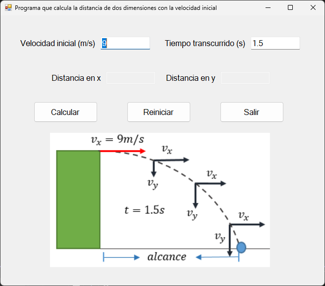

# 🧮 Proyecto de distancia de dos dimensiones

Este proyecto es una aplicación que resuleve el calculo la distancia de dos dimensiones con la velocidad inicial. 

---

## 📷 Captura del Programa

---

## 🛠 Tecnologías usadas

- C# (.NET Framework)
- Windows Forms

---

## 🚀 Cómo ejecutar

1. Abre el proyecto con Visual Studio
2. Compila y ejecuta (F5)
3. Das click en calcular para que veas el resultado del ejemplo de la imagen en el programa.

---

## ✍️ Autor

- Carlos Alberto Medina Beltran
